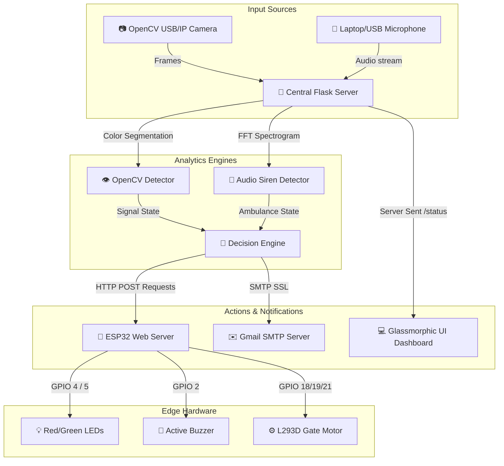

# 🚦 SignalDetect — Smart Ambulance Priority Traffic System
[](https://www.python.org/)
[](https://flask.palletsprojects.com/)
[](https://opencv.org/)
[](https://www.espressif.com/)
[](LICENSE)

An intelligent, IoT-enabled traffic priority system designed to dynamically detect emergency vehicles (ambulances) using **Computer Vision (OpenCV)** and **Acoustic Siren Analysis (FFT)**, automatically overriding traffic signals to clear the lane and granting emergency vehicles seamless passage.

This project was built for the **VKIT Hackathon** to solve critical delays experienced by emergency vehicles at intersections.

---

## 📸 Dashboard Preview
The system features a **state-of-the-art Glassmorphic Web Dashboard** with real-time video feeds, live telemetry charts, voice announcements, and manual overrides.


---

## 🌟 Key Features

### 1. 👁️ Computer Vision Traffic Signal Detection (`detector.py`)
- **HSV Color Segmentation**: Uses OpenCV to isolate and track Red, Yellow, and Green traffic light signals.
- **Error & Malfunction Handling**: Automatically flags an `ERROR` state if multiple signals are active simultaneously (preventing accidents due to signal bugs).
- **Latency Optimization**: Features automatic frame downscaling ($320 \times 240$), aggressive JPEG compression ($30\%$ quality), and a capped frame rate (30 FPS) to ensure zero-lag MJPEG streaming over local networks.

### 2. 🎤 Acoustic Siren Frequency Analyzer (`sound_detector.py`)
- **Real-Time FFT (Fast Fourier Transform)**: Samples audio at $44.1\text{ kHz}$ using `pyaudio` and computes live frequency spectra.
- **Siren Band Energy Filtering**: Monitors the typical siren band ($700\text{ Hz}$ to $2500\text{ Hz}$). If $>30\%$ of total ambient audio energy is concentrated in this band and exceeds the silence RMS floor, it triggers the priority alert.
- **Smart Hold Window**: Retains the active ambulance status for $3\text{ seconds}$ after a signal drops to prevent flickering due to brief audio gaps.

### 3. 🌐 Central Decision Engine & Web Server (`app.py`)
- **Intelligent Override**: Combines camera and sound inputs to determine the optimal action (`MOVE`, `STOP`, `YELLOW`, or `IDLE`). If an ambulance is heard and the signal is Red, it immediately overrides the system to `STOP` normal traffic and open the gates.
- **Voice Announcements**: Utilizes the browser's Web Speech API to provide live, audible status updates (e.g., *"Ambulance Siren Detected - Traffic Override Active"*).
- **Beautiful HTML Email Alerts**: Integrates Gmail SMTP to send gorgeous, custom-styled HTML notification cards directly to emergency services or traffic control rooms upon any signal state change.

### 4. 🔌 Edge Hardware Integration (`firmware/`)
- Powered by an **ESP32 Dev Board** hosting a high-performance local HTTP server.
- Controls a **Red LED**, **Green LED**, an **Active Buzzer** (programmed with non-blocking timers for distinct alarm patterns), and a **DC Motor** simulating an automated traffic gate via an **L293D Motor Driver**.

---

## 📐 System Architecture



---

## 🔌 Pin Mapping & Hardware Wiring

Please refer to the detailed [HARDWARE.md](HARDWARE.md) guide for comprehensive schematics and wiring directions.

| Component | ESP32 Pin (GPIO) | Description |
| :--- | :--- | :--- |
| **Green LED** | `GPIO 5` | Status: MOVE (Signal is Green) |
| **Red LED** | `GPIO 4` | Status: STOP (Signal is Red / Ambulance Priority) |
| **Active Buzzer** | `GPIO 2` | Audio Alerts (Short beeps for MOVE, Sustained for STOP) |
| **L293D EN (Enable)**| `GPIO 21` | Gate Motor Speed / Enable (PWM capable) |
| **L293D IN1** | `GPIO 18` | Gate Motor Direction Control 1 |
| **L293D IN2** | `GPIO 19` | Gate Motor Direction Control 2 |

---

## 🚀 Setup & Installation

### 1. Prerequisites & Dependencies
Ensure you have **Python 3.8+** installed.

#### 🎙️ PyAudio Sound Requirements
Since PyAudio compiles against system audio APIs, install the following before proceeding:
- **Debian/Ubuntu**: `sudo apt install portaudio19-dev python3-pyaudio`
- **macOS**: `brew install portaudio`
- **Windows**: No extra dependencies needed, pip will install pre-compiled wheels.

### 2. Software Installation
1. Clone this repository:
   ```bash
   git clone https://github.com/Jeevan0714/V-Hackathon.git
   cd "smart trafic cntrol"
   ```
2. Create and activate a virtual environment:
   ```bash
   python3 -m venv venv
   source venv/bin/activate  # On Windows use: venv\Scripts\activate
   ```
3. Install the required libraries:
   ```bash
   pip install -r requirements.txt
   ```

### 3. ESP32 Firmware Installation
1. Open the Arduino IDE.
2. Open `firmware/esp32_traffic.ino`.
3. In `esp32_traffic.ino`, update your **WiFi credentials**:
   ```cpp
   const char* WIFI_SSID     = "Your_WiFi_Name";
   const char* WIFI_PASSWORD = "Your_WiFi_Password";
   ```
4. Connect your ESP32 to your computer via USB, select the correct board and COM port, and click **Upload**.
5. Once uploaded, open the **Serial Monitor (115200 baud)**. Upon successful connection, copy the printed **ESP32 IP Address**.

---

## ⚙️ Configuration & Customization

Before running, customize the system configuration in `app.py`:

### 📧 SMTP Email Configuration
To receive live styled email notifications:
1. In `app.py`, update the email variables:
   ```python
   ALERT_EMAIL_FROM     = "your-gmail@gmail.com"
   ALERT_EMAIL_PASSWORD = "your-app-password"   # Google App Password
   ALERT_EMAIL_TO       = "recipient-email@gmail.com"
   EMAIL_ALERTS_ENABLED = True
   ```
   > [!TIP]
   > For Gmail, you must generate an **App Password** via your Google Account security settings. Do **NOT** use your raw account password.

### 📶 ESP32 IP Configuration
Copy the ESP32 IP address obtained from the Serial Monitor and paste it into `app.py` or configure it directly in the Web Dashboard at runtime:
```python
ESP32_IP = "http://192.168.x.x"  # ← Set your ESP32 IP
```

---

## 🎮 Running the Application

1. Launch the Flask web server:
   ```bash
   python app.py
   ```
2. Open your web browser and navigate to:
   ```
   http://localhost:5000
   ```
3. **Configure at Runtime**:
   - **Camera Stream**: By default, the app uses your laptop webcam (Device `0`). To use an IP Webcam, enter its URL (e.g. `http://192.168.1.50:8080`) in the configuration panel and click **Connect**.
   - **ESP32 Connection**: Enter the ESP32 IP address in the configuration panel and click **Set IP**. The ESP32 status indicator will glow green when connected.

---

## 🏆 Hackathon Demonstration Tips

No real ambulance nearby? No problem! The system is fully optimized for hackathon presentations:
- **🚑 Demo Siren Button**: Use the **"Demo Siren"** button in the Web Dashboard. Clicking it mimics an active ambulance detection, immediately overriding the state and sending commands to the ESP32.
- **⚙️ Hardware Overrides**: Use the manual **MOVE**, **STOP**, and **IDLE** buttons in the dashboard to manually trigger individual hardware actuators (LEDs, gates, buzzers) on demand.
- **🔊 Voice Announcements**: Turn on the **Voice** toggle in the UI to let the browser speak state changes out loud. This always creates a massive "WOW" effect for judges!

---

## 📁 Project Structure

```
smart trafic cntrol/
│
├── firmware/
│   └── esp32_traffic.ino      # ESP32 C++ HTTP Server and Hardware Actuators
│
├── static/
│   ├── css/
│   │   └── style.css          # Premium Glassmorphic Stylesheet
│   ├── js/
│   │   └── script.js          # Live telemetry updates, Web Speech API & dashboard logic
│   └── hero.png               # System dashboard preview image
│
├── templates/
│   └── index.html             # HTML5 dashboard layout with active HUD overlay
│
├── app.py                     # Main Flask Application & Event Decisions
├── detector.py                # OpenCV-based Color Traffic Signal Recognizer
├── sound_detector.py          # PyAudio FFT Siren Detector
├── HARDWARE.md                # Comprehensive ESP32 to L293D Connection Guide
└── requirements.txt           # Python Project Dependencies
```

---

## 📄 License
This project is licensed under the MIT License - see the [LICENSE](LICENSE) file for details.

---

> [!NOTE]
> Designed & developed with 💖 for the **VKIT Hackathon**. Powered by **Robomanthan Pvt Ltd** hardware specifications.
